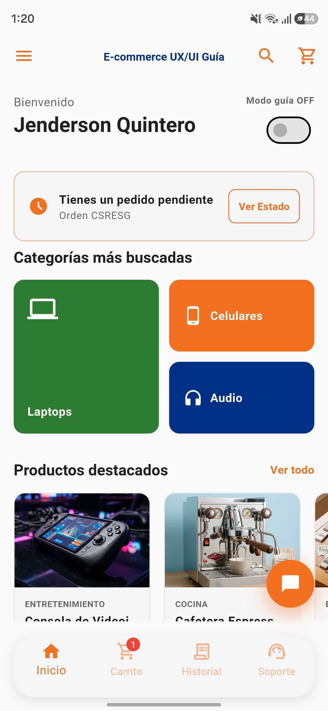
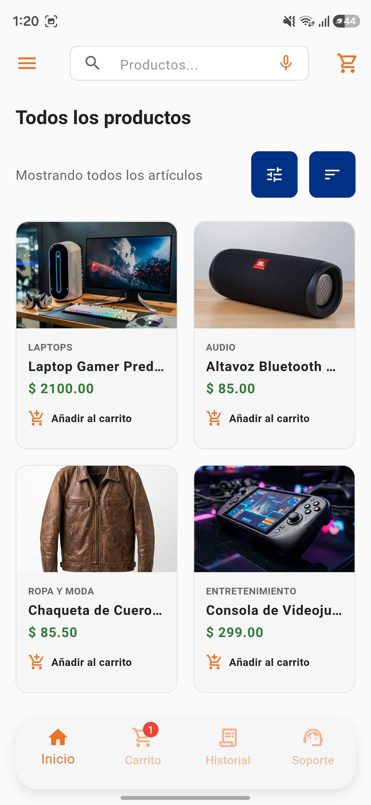
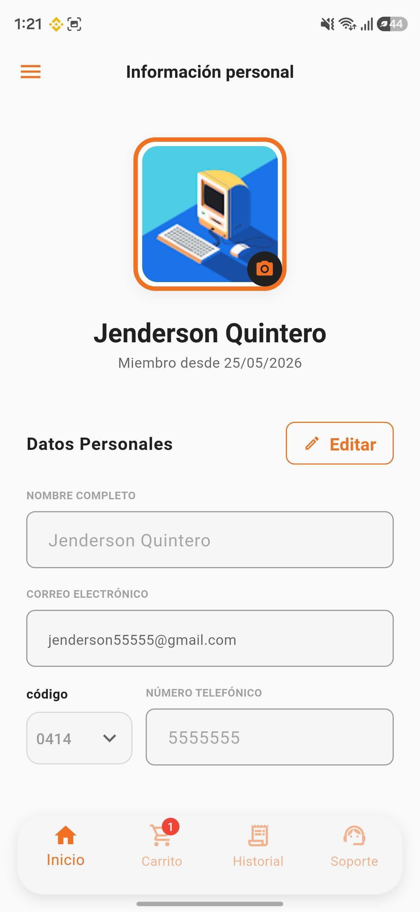
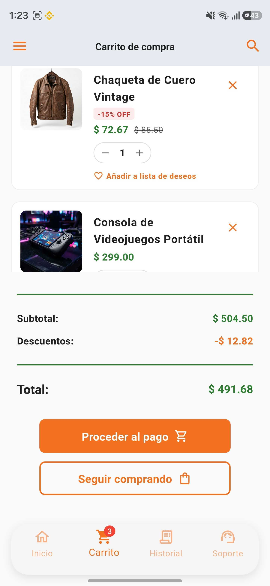
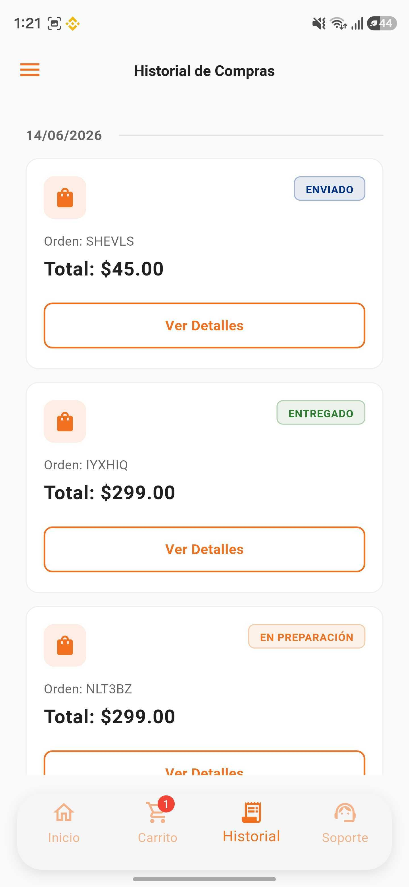
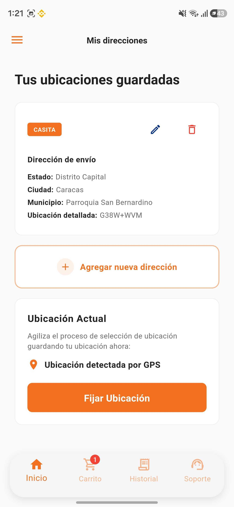
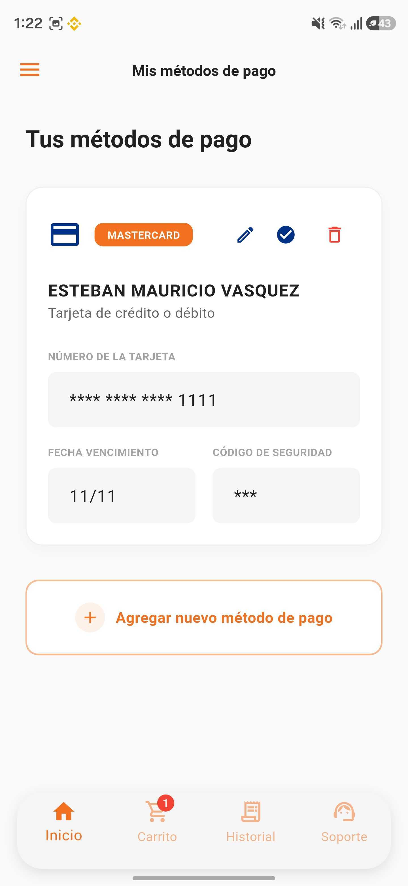
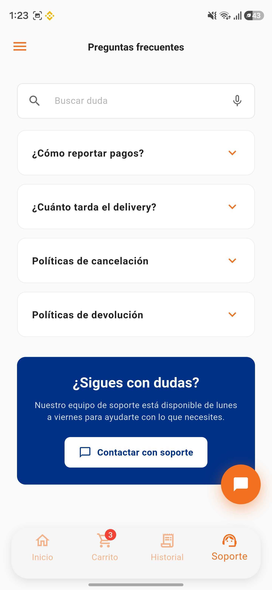
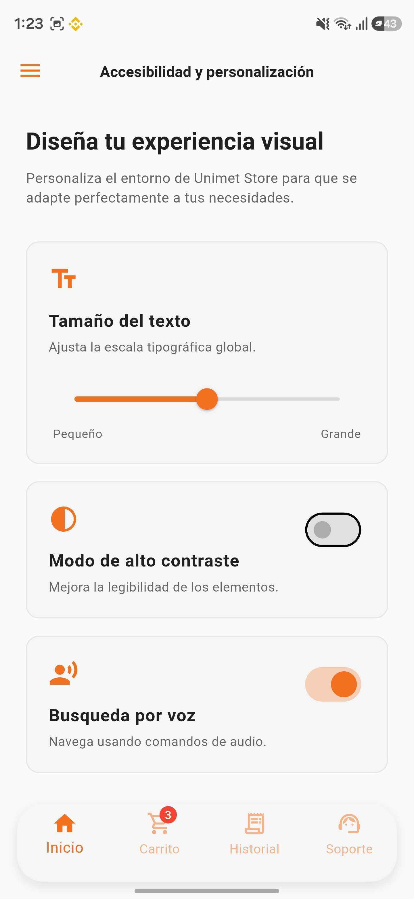
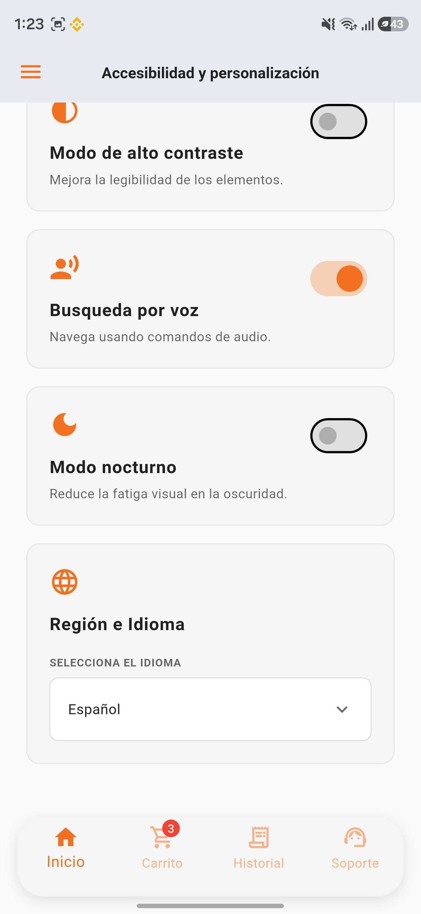

# Guía UX/UI E-Commerce 🛒🎨

Una aplicación educativa desarrollada en Flutter para demostrar las mejores prácticas, arquitecturas de diseño visual (UI) y experiencia de usuario (UX) en aplicaciones modernas de comercio electrónico para móviles Android.

---

## 🎨 Sistema de Diseño (Design System)

La identidad visual del proyecto fue construida meticulosamente para garantizar legibilidad, profesionalismo y accesibilidad en dispositivos móviles.

### Metodología y Herramientas (Design Thinking)
El desarrollo conceptual y visual se rigió estrictamente bajo la metodología **Design Thinking**, iterando sobre las etapas de empatía, definición, ideación, prototipado y evaluación para poner al usuario en el centro del producto.
- **Prototipado y UI:** Se utilizaron herramientas líderes en la industria (como Figma) para la creación de *wireframes* y componentes interactivos antes del desarrollo.
- **Generación de Activos:** La evolución gráfica del logotipo y los recursos visuales aprovecharon tecnologías de vanguardia e IA generativa para garantizar un aspecto moderno y plano.

### Paleta de Colores Corporativa
El esquema de colores utiliza un alto contraste para guiar la vista del usuario hacia las acciones principales:
- 🔵 **Azul Sistemas (`#003087`):** Color principal, utilizado en fondos institucionales, botones de acción primarios y la estructura de navegación. Aporta formalidad y confianza.
- 🟠 **Naranja (`#F37021`):** Color de acento. Utilizado para notificaciones, llamados a la acción (CTAs) de venta y elementos interactivos clave.
- 🟢 **Verde Samán (`#2E7D32`):** Color semántico. Usado en estados de éxito, confirmaciones de compras y elementos sutiles del ecosistema de la app.

### El Icono de la Aplicación
El desarrollo del icono nativo atravesó un proceso riguroso de diseño plano (Flat Design):
1. **Full Bleed:** Se forzó un relleno azul (`#003087`) sin márgenes para que los algoritmos de iOS y Android apliquen el "squircle" (borde redondeado) de forma inmersiva y nativa.
2. **Minimalismo:** Se utilizó un libro naranja cerrado como base (representando la "Guía") y una bolsa de compras blanca con un asa verde, maximizando el contraste y la legibilidad en resoluciones pequeñas (50x50 px).

---

## 📱 Visual Showcase (Capturas de Pantalla)

  
  &nbsp;&nbsp;&nbsp;
  
  &nbsp;&nbsp;&nbsp;
  
  &nbsp;&nbsp;&nbsp;
  
  &nbsp;&nbsp;&nbsp;
  
  &nbsp;&nbsp;&nbsp;
  
  &nbsp;&nbsp;&nbsp;
  
  &nbsp;&nbsp;&nbsp;
  
  &nbsp;&nbsp;&nbsp;
  
  &nbsp;&nbsp;&nbsp;
  
  &nbsp;&nbsp;&nbsp;
  

---

## 🧠 Decisiones Clave de UX/UI y Detalles Técnicos

Cada característica de la aplicación fue diseñada resolviendo un problema específico de fricción para el usuario. A continuación, el razonamiento detrás de los flujos de la aplicación, acompañado de su implementación técnica en Flutter:

### 1. El "Modo Guía" (Onboarding Interactivo)
- **¿Qué es?** Es un sistema integrado para educar al usuario de forma progresiva sobre cómo navegar y sacar provecho de las funciones del e-commerce.
- **Activación:** Se puede encender o apagar a voluntad del usuario, brindándole el control total de su experiencia.
- **Ventajas UX:** Al estar activo, despliega *tooltips* interactivos que resaltan áreas de la pantalla, explicando funciones o flujos de manera visual y directa. Es la herramienta definitiva para acortar la curva de aprendizaje en usuarios poco digitalizados.

### 2. Visibilidad del Estado del Sistema (Progreso)
- **Decisión (UX):** Aplicando la primera heurística de Nielsen, el usuario nunca debe sentirse "perdido" en un flujo de varios pasos.
- **Solución:** En procesos complejos (como llenar direcciones o el checkout), la aplicación mantiene a la vista **indicadores de progreso visuales**, mostrando claramente qué pasos se han completado, en cuál está actualmente y cuántos faltan para terminar.

### 3. Transparencia y Claridad en el Carrito de Compras
- **Problema:** El abandono del carrito (Cart Abandonment) ocurre frecuentemente por sorpresas en los precios o confusión visual.
- **Solución:** Se diseñó una interfaz inmaculada donde la cantidad exacta de productos, el desglose de montos (subtotal, impuestos) y el costo final están siempre visibles. Se utiliza una fuerte jerarquía tipográfica para que el botón de pago y el monto total sean inconfundibles.

### 4. Accesibilidad Total e Inclusión
La accesibilidad fue un pilar desde el día uno:
- **Búsqueda por Voz:** Se integró la funcionalidad de dictado por voz (ideal para usuarios con limitaciones motoras o situacionales). Durante la escucha, la UI despliega un banner de estado activo que reduce la ansiedad del usuario dándole retroalimentación inmediata.
- **Inclusión Visual:** Toda la estructura fue diseñada considerando tipografías legibles y soporte para altos contrastes, así tambien el cambio de tamaño del texto, cambio entre modo oscuro y claro e incluso el cambio de idioma de español a inglés; permitiendo un uso fluido sin forzar la vista.

### 5. Soporte Omnipresente (Botón Flotante y FAQ)
- **Decisión (UX):** El usuario necesita sentir que la "ayuda" está a un toque de distancia, sin importar en qué pantalla de la tienda se encuentre.
- **Solución:** Se implementó un acceso rápido y flotante (o persistente) en múltiples vistas que enlaza directamente a la pantalla de Preguntas Frecuentes y Soporte, creando una red de contención continua para el cliente.

### 6. Sistema de Notificaciones Globales (Tooltips)
- **Problema (UX):** Tradicionalmente, los `SnackBar` aparecen en la parte inferior y son bloqueados por el teclado del dispositivo, lo que impide leer mensajes de error.
- **Solución Técnica:** Diseñamos un componente propio (`CustomNotification`) utilizando el sistema **`Overlay`** global de Flutter. Al inyectar las notificaciones como un `OverlayEntry`, garantizamos que las alertas "floten" por encima de cualquier otro elemento gráfico del sistema operativo (teclados, modales, etc.).

### 7. Fricción Cero en la Autenticación (Google Sign In)
- **Restricciones Lógicas (UX):** Si un usuario inicia sesión con Google, es confuso y peligroso ofrecerle la opción de "Cambiar Contraseña" dentro de la app, ya que la contraseña le pertenece a Google.
- **Solución Técnica:** El `AuthRepository` valida la matriz `user.providerData`. Si detecta el token `google.com`, el sistema bloquea o esconde inteligentemente la opción de cambio de contraseña, previniendo un callejón sin salida (Dead End).

### 8. Fatiga de Decisión en el Catálogo y Estados Vacíos
- **Límites Visuales:** En lugar de dejar un filtro de precio al infinito que frustra al usuario, se estableció un límite visual (Máx: 5000), "acotando" el mapa mental del comprador.
- **Empty States:** Nunca se deja al usuario frente a una pantalla "en blanco". Si el carrito está vacío o no hay historial, se muestran banners ilustrativos invitando amablemente a regresar al catálogo.

---

## 🚀 Despliegue y Pruebas (Firebase App Distribution)

Para probar esta aplicación con los más altos estándares de calidad empresarial, se configuró la integración continua manual utilizando **Firebase App Distribution**. 

Esto permite:
- Distribuir las versiones beta (`app-release.apk`) a correos electrónicos autorizados de manera segura.
- Ofrecer al jurado un portal elegante (mediante la app *App Tester*) para instalar la aplicación con un solo clic, aislada del escrutinio público de Google Play Store, pero con el mismo rigor técnico.

---
*Desarrollado para la demostración del ecosistema de aplicaciones E-Commerce.*
