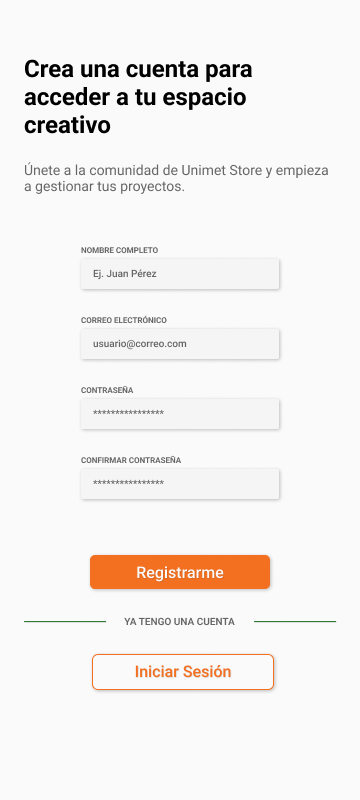
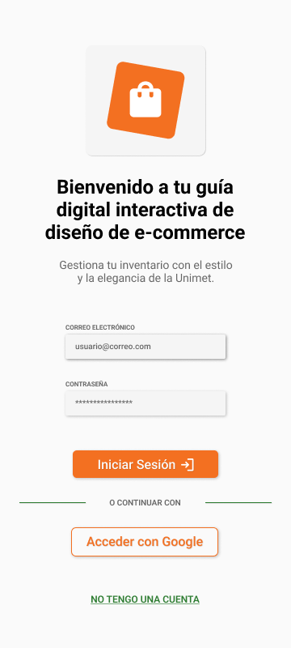
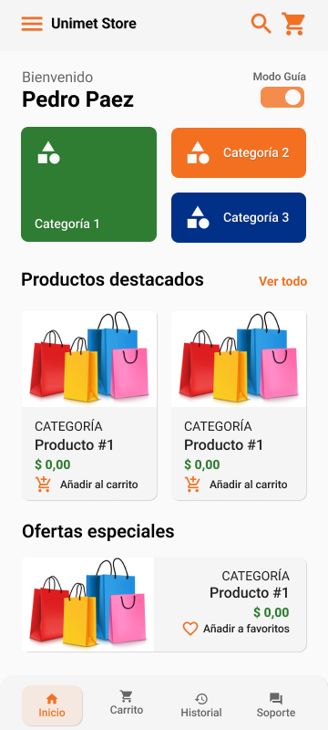
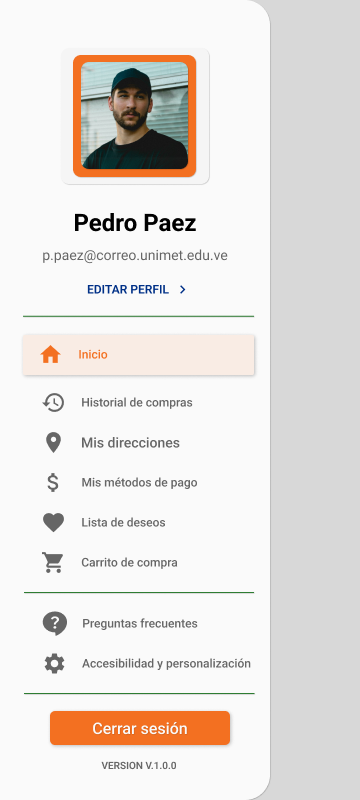
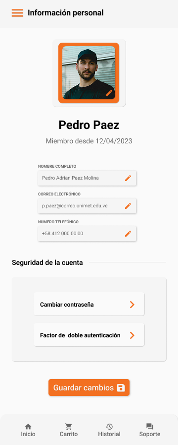
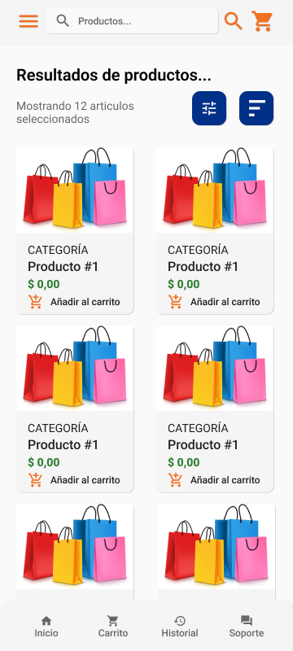
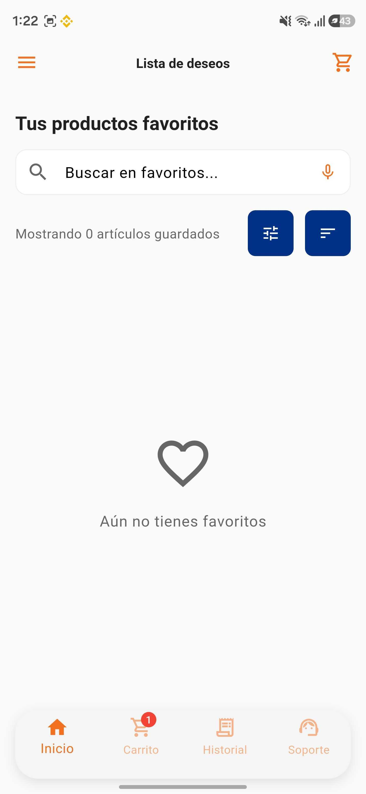
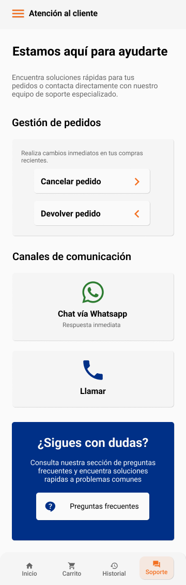
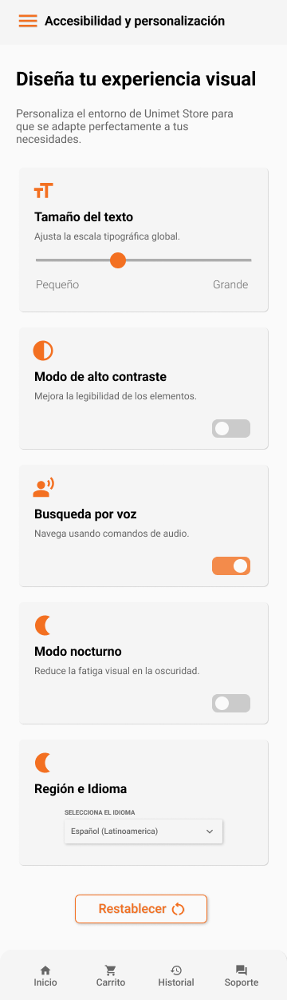

# Guía UX/UI E-Commerce 🛒🎨

Una plataforma digital desarrollada como guía práctica e interactiva para mejorar la usabilidad, accesibilidad y experiencia de usuario (UX) en interfaces de comercio electrónico, promoviendo la adopción de buenas prácticas en el diseño de software.

---

## 🎨 Sistema de Diseño

La identidad visual y estructural del proyecto fue construida meticulosamente para garantizar legibilidad, profesionalismo y accesibilidad en dispositivos móviles, fundamentándose en los lineamientos de la Norma ISO 29148:2011 de Ingeniería de Requisitos.

### Metodología y Herramientas (Design Thinking)
El desarrollo conceptual y visual se rigió estrictamente bajo la metodología **Design Thinking**, iterando sobre las etapas de empatizar, definir, idear, prototipar y evaluar para poner al usuario en el centro del producto.
- **Prototipado y UI:** Se utilizaron herramientas líderes en la industria (como Miro y Figma) para la creación de wireframes, mapas de contenido y componentes interactivos antes del desarrollo. En Miro se validaron flujos básicos y esquemáticos, mientras que Figma permitió consolidar un prototipo de alta fidelidad.

### Paleta de Colores Corporativa
Inspirada cromáticamente en los colores institucionales de la Universidad Metropolitana y la Facultad de Ingeniería, estableciendo un sentido de pertenencia y profesionalismo académico. El esquema de colores utiliza un alto contraste para favorecer la accesibilidad visual:
- 🔵 **Azul Sistemas (`#003087`):** Color principal, utilizado en fondos institucionales, botones de acción primarios y la estructura de navegación.
- 🟠 **Naranja Unimet (`#F37021`):** Color de acento. Utilizado para notificaciones, llamados a la acción (CTAs) y elementos interactivos clave.
- 🟢 **Verde Samán (`#2E7D32`):** Color semántico. Usado en estados de éxito y confirmaciones.

### El Icono de la Aplicación
El desarrollo del icono nativo atravesó un proceso riguroso de diseño plano (Flat Design):
- Se utilizó un libro naranja cerrado como base (representando la "Guía") y una bolsa de compras blanca (representado el e-commerce), maximizando el contraste y la legibilidad en resoluciones pequeñas (50x50 px).

---

## 📱 Visual Showcase (Capturas de Pantalla)

  
  &nbsp;&nbsp;&nbsp;
  
  &nbsp;&nbsp;&nbsp;
  
  &nbsp;&nbsp;&nbsp;
  
  &nbsp;&nbsp;&nbsp;
  
  &nbsp;&nbsp;&nbsp;
  
  &nbsp;&nbsp;&nbsp;
  
  &nbsp;&nbsp;&nbsp;
  
  &nbsp;&nbsp;&nbsp;
  
  &nbsp;&nbsp;&nbsp;
  
  &nbsp;&nbsp;&nbsp;
  
  &nbsp;&nbsp;&nbsp;
  
  &nbsp;&nbsp;&nbsp;
  
  &nbsp;&nbsp;&nbsp;
  
  &nbsp;&nbsp;&nbsp;
  
  &nbsp;&nbsp;&nbsp;
  
  &nbsp;&nbsp;&nbsp;
  
  &nbsp;&nbsp;&nbsp;
  
  &nbsp;&nbsp;&nbsp;
  
  &nbsp;&nbsp;&nbsp;
  
  &nbsp;&nbsp;&nbsp;
  

---

## 🧠 Decisiones Clave de UX/UI y Detalles Técnicos

La construcción de la interfaz gráfica se apoyó en Material Design 3, aplicando rigurosamente las Heurísticas de Usabilidad de Nielsen.

### 1. El "Modo Guía" (Onboarding Educativo)
- **¿Qué es?** Un elemento diferenciador que consiste en una capa educativa que transforma un e-commerce convencional en un proceso de aprendizaje asistido.
- **Ventajas UX:** Alineado con la lógica del Design Thinking, responde a una necesidad real del usuario mejorando su autonomía durante la interacción y reduciendo la fricción percibida.

### 2. Visibilidad del Estado del Sistema (Progreso)
- **Decisión (UX):** Aplicando la heurística de mantener al usuario informado mediante retroalimentación oportuna.
- **Solución:** En el flujo de pago (*checkout*) se programó un proceso guiado secuencialmente mediante **indicadores de progreso visuales**, abordando directamente la frustración y el abandono de carritos.

### 3. Transparencia y Claridad en el Carrito de Compras
- **Problema:** El abandono del carrito (Cart Abandonment) ocurre frecuentemente por sorpresas en los precios o confusión visual.
- **Solución:** Se diseñó una interfaz inmaculada donde la cantidad exacta de productos, el desglose de montos (subtotal, descuentos) y el costo final están siempre visibles. Se utiliza una fuerte jerarquía tipográfica para que el botón de pago y el monto total sean inconfundibles.

### 4. Accesibilidad Nativa e Inclusión
Para hacer que el contenido sea perceptible, operable y comprensible (W3C), se implementó:
- **Búsqueda por Voz:** Integración de la API *Google Speech-to-Text* para dictar términos en lenguaje natural, agilizando la navegación y eliminando barreras motoras.
- **Compatibilidad con Lectores de Pantalla:** Se aplicó la clase `Semantics` propia del framework Flutter para dotar al árbol de componentes con descripciones de texto alternativas (compatibilidad nativa con *TalkBack*).
- **Inclusión Visual:** Se integró soporte para el escalado dinámico de fuentes y altos contrastes de color.

### 5. Prevención y Diagnóstico de Errores
- **Validaciones en Tiempo Real:** Los formularios de ingreso de datos previenen la introducción de información errónea. Se incorporó detección automática de tarjetas de crédito (Visa/Mastercard).
- **Manejo de Excepciones:** Se interceptaron las excepciones genéricas provenientes de Firebase, sustituyendo mensajes técnicos confusos por indicaciones constructivas y claras para el usuario final.

### 6. Sistema de Notificaciones Globales
- **Problema (UX):** Tradicionalmente, los SnackBar aparecen en la parte inferior y son bloqueados por el teclado del dispositivo, lo que impide leer mensajes de error.
- **Solución Técnica:** Diseñamos un componente propio (CustomNotification) utilizando el sistema Overlay global de Flutter. Al inyectar las notificaciones como un OverlayEntry, garantizamos que las alertas "floten" por encima de cualquier otro elemento gráfico del sistema operativo (teclados, modales, etc.).

### 7. Soporte Omnipresente (Acceso Flotante y FAQ)
- **Decisión (UX):** Proveer soporte fácil de encontrar cuando el sistema lo requiera.
- **Solución:** Se implementó un acceso rápido y persistente en la interfaz que enlaza a la sección de ayuda, garantizando una red de soporte continua y reduciendo el Índice de Esfuerzo del Cliente (CES).

### 8. Experiencia de Visualización de Productos
- En cumplimiento de la heurística "Reconocer en lugar de recordar", se desarrolló una funcionalidad de **zoom interactivo** en las galerías de imágenes, otorgando un control detallado sobre la inspección del artículo antes de la compra.

### 9. Fricción Cero en la Autenticación (Google Sign In)
- **Reducción de Fricción:** Para minimizar el abandono temprano y agilizar el registro, se integró el Login Social, permitiendo un acceso rápido y seguro sin la necesidad de que el usuario deba crear o recordar nuevas contraseñas.
- **Restricciones Lógicas (UX):** Si un usuario inicia sesión con Google, es confuso y peligroso ofrecerle la opción de "Cambiar Contraseña" dentro de la app, ya que la contraseña le pertenece a Google.
- **Solución Técnica:** El `AuthRepository` valida la matriz `user.providerData`. Si detecta el token `google.com`, el sistema bloquea o esconde inteligentemente la opción de cambio de contraseña, previniendo un callejón sin salida (Dead End).

### 10. Fatiga de Decisión en el Catálogo
- **Límites Visuales:** En lugar de dejar un filtro de precio al infinito que frustra al usuario, se estableció un límite visual (Máx: el precio del producto mas costoso), "acotando" el mapa mental del comprador.

---

## 🚀 Despliegue y Arquitectura Tecnológica

Para dotar de funcionalidad, persistencia de datos y seguridad al MVP (Producto Mínimo Viable), la aplicación opera bajo un enfoque *Mobile-First*:
- **Frontend:** Desarrollado en **Flutter** (Dart), asegurando un rendimiento óptimo nativo, con gestión de estados a través de **Riverpod** y enrutamiento declarativo con **GoRouter**.
- **Backend:** Plataforma en la nube con **Firebase** (BaaS), utilizando *Firebase Authentication* para la seguridad y *Cloud Firestore* (NoSQL) para consultas asíncronas en tiempo real.

El proyecto se encuentra versionado y respaldado de manera segura, constituyendo un referente replicable de cómo la sinergia entre Design Thinking y una implementación técnica robusta pueden cerrar la brecha digital en el e-commerce local.
